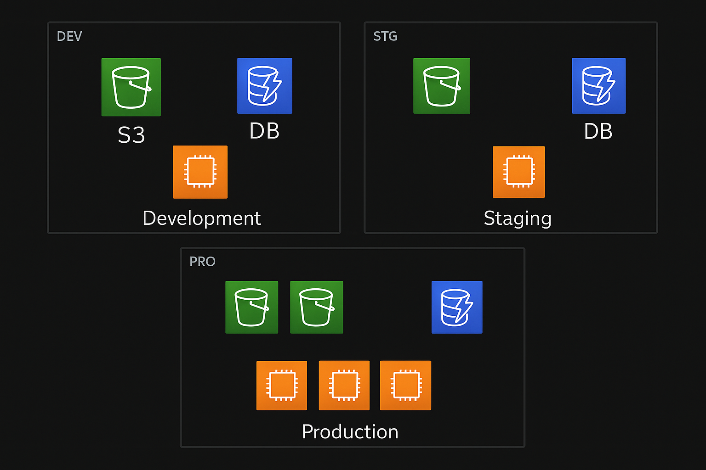

# Terraform AWS Multi-Stage Infrastructure



## Overview

This project provisions a multi-stage AWS infrastructure using Terraform, supporting **Development**, **Staging**, and **Production** environments. Each environment is isolated and can be managed independently, following best practices for cloud resource management.

---

## Project Structure

| File/Folder         | Purpose                                                                                   |
|---------------------|------------------------------------------------------------------------------------------|
| `main.tf`           | The main entrypoint. Declares modules for each environment (dev, stag, prod) and passes environment-specific variables. |
| `AWS_INFRA/`        | **Core module** containing reusable Terraform code for provisioning S3, EC2, and DynamoDB resources. All environments use this module with different parameters. |
| `AWS_INFRA/myinstance.tf` | Defines EC2 instance resources. Parameterized for instance type, count, and tags.         |
| `AWS_INFRA/mybucket.tf`   | Defines S3 bucket resources. Parameterized for bucket count, names, and tags.              |
| `AWS_INFRA/mydynamodb.tf` | Defines DynamoDB table resources. Parameterized for table name and 
environment.             |
| `variables.tf`      | Declares input variables for the project and modules, ensuring flexibility and reusability. |
| `outputs.tf`        | Defines outputs such as instance IPs, bucket names, etc., for easy access after deployment. |
| `diagram.png`       | **Architecture diagram** (see above) visually representing the resources and environments.  |
| `terraform.tfstate` | (Auto-generated) Tracks the current state of your infrastructure. **Do not edit manually.** |
| `terraform.lock.hcl`| (Auto-generated) Locks provider versions for reproducible deployments.                      |

---

## Why This Structure?

- **Modularity:** The `AWS_INFRA` module allows you to reuse the same infrastructure code for different environments, reducing duplication and errors.
- **Separation of Concerns:** Each file focuses on a specific AWS resource, making the codebase easier to maintain and extend.
- **Scalability:** Easily add new environments or scale resources by changing variables in `main.tf`.
- **Visualization:** The included diagram helps understand resource relationships and environment separation at a glance.

---

## Getting Started

1. **Initialize Terraform:**
   ```sh
   terraform init
   ```

2. **Plan the deployment:**
   ```sh
   terraform plan
   ```

3. **Apply the configuration:**
   ```sh
   terraform apply
   ```

4. **Destroy resources when done:**
   ```sh
   terraform destroy
   ```

---

## Notes

- Ensure your AWS credentials are configured before running Terraform.
- S3 bucket names must be globally unique; the module appends environment and index to ensure this.
- The architecture diagram (`diagram.png`) visually maps the resources created for each environment.

---

**Happy Automating!**